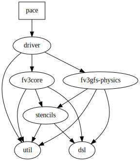

[![CircleCI][circleci-shield]][circleci-url]
[![Contributors][contributors-shield]][contributors-url]
[![Stargazers][stars-shield]][stars-url]
[![Issues][issues-shield]][issues-url]
[![Apache License][license-shield]][license-url]

# Pace

> ⚠️ **READ-ONLY REPOSITORY** ⚠️
>
> Original development was executed under AI2 patronnage. Maintenance and further developpment has been taken over by NOAA-GFDL and can be reached  [here](https://github.com/NOAA-GFDL/pace).

Pace is an implementation of the FV3GFS / SHiELD atmospheric model developed by NOAA/GFDL using the GT4Py domain-specific language in Python. The model can be run on a laptop using Python-based backend or on thousands of heterogeneous compute nodes of a large supercomputer.

Full Sphinx documentation can be found at [https://ai2cm.github.io/pace/](https://ai2cm.github.io/pace/).

## Quickstart - bare metal

### Build

Pace requires GCC > 9.2, MPI, and Python 3.8 on your system, and CUDA is required to run with a GPU backend. You will also need the headers of the boost libraries in your `$PATH` (boost itself does not need to be installed).

```shell
cd BOOST/ROOT
wget https://boostorg.jfrog.io/artifactory/main/release/1.79.0/source/boost_1_79_0.tar.gz
tar -xzf boost_1_79_0.tar.gz
mkdir -p boost_1_79_0/include
mv boost_1_79_0/boost boost_1_79_0/include/
export BOOST_ROOT=BOOST/ROOT/boost_1_79_0
```

When cloning Pace you will need to update the repository's submodules as well:

```shell
git clone --recursive https://github.com/ai2cm/pace.git
```

or if you have already cloned the repository:

```
git submodule update --init --recursive
```

We recommend creating a python `venv` or conda environment specifically for Pace.

```shell
python3 -m venv venv_name
source venv_name/bin/activate
```

Inside of your pace `venv` or conda environment pip install the Python requirements, GT4Py, and Pace:

```shell
pip3 install -r requirements_dev.txt -c constraints.txt
```

Shell scripts to install Pace on specific machines such as Gaea can be found in `examples/build_scripts/`.

### Run

With the environment activated, you can run an example baroclinic test case with the following command:

```shell
mpirun -n 6 python3 -m pace.driver.run driver/examples/configs/baroclinic_c12.yaml

# or with oversubscribe if you do not have at least 6 cores
mpirun -n 6 --oversubscribe python3 -m pace.driver.run driver/examples/configs/baroclinic_c12.yaml
```

After the run completes, you will see an output direcotry `output.zarr`. An example to visualize the output is provided in `driver/examples/plot_output.py`. See the [driver example](driver/examples/README.md) section for more details.

## Quickstart - Docker

### Build

While it is possible to install and build pace bare-metal, we can ensure all system libraries are installed with the correct versions by using a Docker container to test and develop pace.

First, you will need to update the git submodules so that any dependencies are cloned and at the correct version:

```shell
git submodule update --init --recursive
```

Then build the `pace` docker image at the top level.

```shell
make build
```

### Run

```shell
make dev
mpirun --mca btl_vader_single_copy_mechanism none -n 6 python3 -m pace.driver.run /pace/driver/examples/configs/baroclinic_c12.yaml
```

## Running translate tests

See the [translate tests](stencils/pace/stencils/testing/README.md) section for more information.

## Repository structure

The top-level directory contains the main components of pace such as the dynamical core, the physical parameterizations and utilities.

This git repository is laid out as a mono-repo, containing multiple independent projects. Because of this, it is important not to introduce unintended dependencies between projects. The graph below indicates a project depends on another by an arrow pointing from the parent project to its dependency. For example, the tests for fv3core should be able to run with only files contained under the fv3core and util projects, and should not access any files in the driver or physics packages. Only the top-level tests in Pace are allowed to read all files.



## ML emulation

An example of integration of an ML model replacing the microphysics parametrization is available on the `feature/microphysics-emulator` branch.

[circleci-shield]: https://dl.circleci.com/status-badge/img/gh/ai2cm/pace/tree/main.svg?style=svg
[circleci-url]: https://dl.circleci.com/status-badge/redirect/gh/ai2cm/pace/tree/main
[contributors-shield]: https://img.shields.io/github/contributors/ai2cm/pace.svg
[contributors-url]: https://github.com/ai2cm/pace/graphs/contributors
[stars-shield]: https://img.shields.io/github/stars/ai2cm/pace.svg
[stars-url]: https://github.com/ai2cm/pace/stargazers
[issues-shield]: https://img.shields.io/github/issues/ai2cm/pace.svg
[issues-url]: https://github.com/ai2cm/pace/issues
[license-shield]: https://img.shields.io/github/license/ai2cm/pace.svg
[license-url]: https://github.com/ai2cm/pace/blob/main/LICENSE.md
